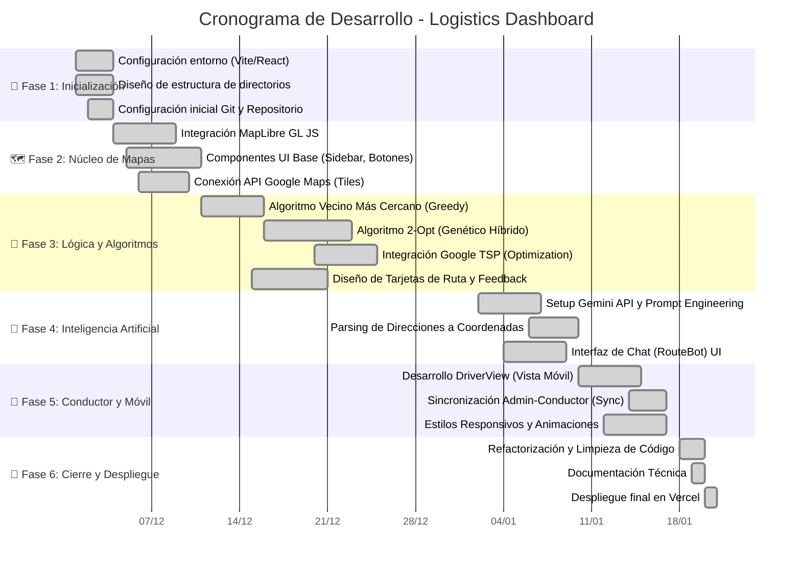

# 📅 Cronograma de Trabajo y Asignación de Tareas - Logistics Dashboard
**Período:** 1 de Diciembre 2025 - 20 de Enero 2026

Este documento detalla la distribución de tareas y la línea de tiempo de ejecución del proyecto *Route Assigner*, asignada al equipo de desarrollo.

---

## 👥 Equipo de Desarrollo

| Nombre | Rol Principal | Enfoque |
|--------|--------------|---------|
| **José Andrés Domínguez Peñaloza** | Lead Dev / Backend Logic | Algoritmos de optimización, integración de Mapas y lógica del núcleo. |
| **Keyler David Guerra Urdaneta** | Frontend / UI-UX | Diseño de interfaz, Dashboards, estética del sistema y componentes React. |
| **Daniel Andrés Mejía de la Hoz** | Fullstack / Integraciones | Integración IA (Gemini), Vista del Conductor (Móvil) y Despliegue. |

---

## 📊 Diagrama de Gantt

---

## 📝 Detalle de Responsabilidades por Desarrollador

### 👨‍💻 José Andrés Domínguez (Lógica y Mapas)
*   **01-05 Dic:** Implementación del motor de mapas (`MapComponent`) y gestión de marcadores.
*   **11-23 Dic:** Desarrollo intensivo de `googleDirectionsService.js`. Creación de las estrategias de ruteo (`greedy`, `two-opt`) y lógica matemática de distancias.
*   **14-17 Ene:** Implementación de la lógica de sincronización `localStorage` para comunicar el Dashboard con la vista del conductor.
*   **18 Ene:** Revisión de performance y corrección de bugs críticos en el renderizado de líneas.

### 👨‍🎨 Keyler David Guerra (Frontend y Experiencia)
*   **01-10 Dic:** Creación del sistema de diseño (colores oscuros, tarjetas, tipografías). Construcción de `Sidebar.jsx`.
*   **15-22 Dic:** Diseño de las tarjetas de algoritmos ("Ruta Rápida", "Genético") y visualización de estadísticas (Km, Tiempo).
*   **04-09 Ene:** Diseño del Chatbot (`RouteBot`) y sus burbujas de mensaje.
*   **12-16 Ene:** Adaptación "Mobile First". Asegurar que la UI se vea perfecta en celulares (Carrusel de opciones, botones flotantes).
*   **20 Ene:** Despliegue y configuración visual final.

### 👨‍🔧 Daniel Andrés Mejía (Integraciones y Móvil)
*   **02-05 Dic:** Configuración de repositorios y variables de entorno (`.env`).
*   **02-08 Ene:** Integración con Google Gemini. Desarrollo del `geminiService.js` para traducir texto natural a coordenadas JSON.
*   **10-15 Ene:** Construcción de la `DriverView.jsx`. Lógica para leer parámetros URL y botones de "Navegar con Waze/Maps".
*   **19 Ene:** Redacción de documentación técnica y manuales de usuario.
